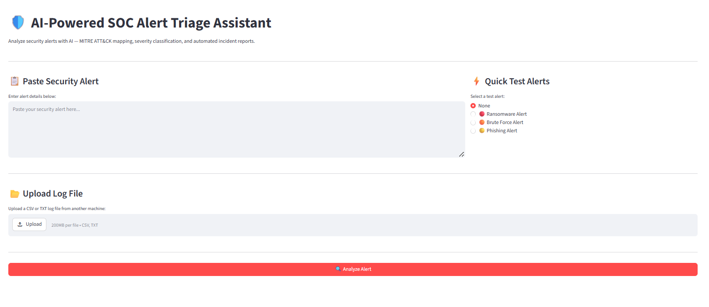
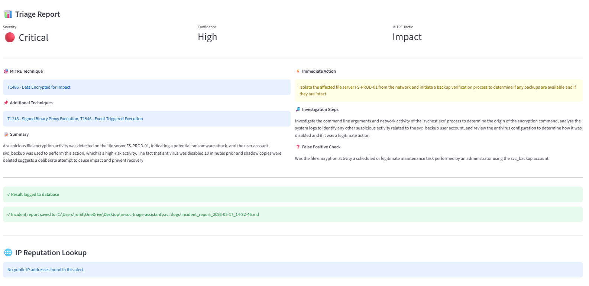
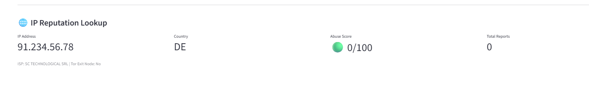
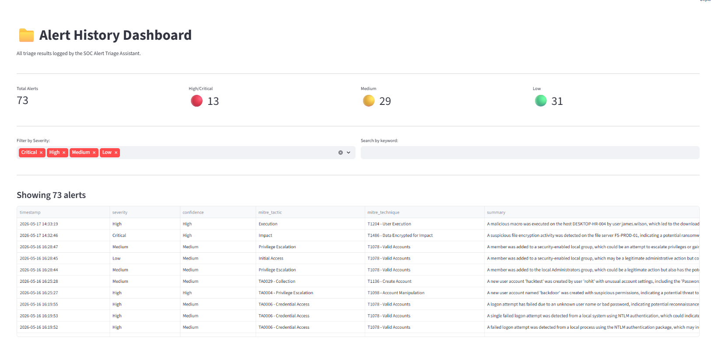

# 🛡️ AI-Powered SOC Alert Triage Assistant

An AI-assisted security alert triage tool built for SOC analysts. Classifies alerts by severity, maps them to MITRE ATT&CK techniques, performs IP reputation lookups, and auto-generates incident reports.

## 🎯 What It Does

- **AI Triage** — Analyzes security alerts using Groq API (LLaMA 3.3 70B) and returns structured triage output
- **MITRE ATT&CK Mapping** — Maps every alert to relevant tactics and techniques automatically
- **Severity Classification** — Low / Medium / High / Critical with confidence scoring
- **IP Reputation Lookup** — Real-time threat intel via AbuseIPDB (country, abuse score, ISP, Tor detection)
- **Windows Event Log Ingestion** — Pulls live logs directly from Windows Security event log
- **File Upload** — Upload CSV or TXT log files from any machine for bulk triage
- **Brute Force Correlation** — Automatically detects and escalates brute force patterns
- **SQLite Case Logging** — Every triage result saved to database automatically
- **Automated Incident Reports** — Markdown report generated for every alert
- **Alert History Dashboard** — View, filter, and analyze all past triage results

## 🖥️ Tech Stack

- Python 3.x
- Groq API (LLaMA 3.3 70B)
- AbuseIPDB API
- SQLite
- Streamlit
- PowerShell (Windows Event Log ingestion)


## 📁 Project Structure

ai-soc-triage-assistant/
├── app.py              # Streamlit web UI
├── src/
│   ├── triage.py       # AI triage engine
│   ├── logger.py       # Windows log ingestion + SQLite logging
│   ├── reporter.py     # Incident report generation
│   └── ip_lookup.py    # AbuseIPDB IP reputation lookup
├── pages/
│   └── history.py      # Alert history dashboard
├── logs/               # SQLite database + incident reports
├── screenshots/        # Demo screenshots
├── requirements.txt
└── .env                # API keys (not committed)

## ⚙️ Setup Instructions

### 1. Clone the repository
```bash
git clone https://github.com/rohith0512/ai-soc-triage-assistant
cd ai-soc-triage-assistant
```

### 2. Install dependencies
```bash
python -m pip install -r requirements.txt
```

### 3. Get API keys
- **Groq API** (free) — https://console.groq.com
- **AbuseIPDB API** (free) — https://www.abuseipdb.com

### 4. Configure environment
Create a `.env` file in the root folder:
GROQ_API_KEY=your_groq_key_here
ABUSEIPDB_API_KEY=your_abuseipdb_key_here

### 5. Run the app
```bash
python -m streamlit run app.py
```

Open your browser at `http://localhost:8501`

> **Note:** Run as administrator on Windows for Windows Event Log access.

## 🖼️ Demo Screenshots

### Main Dashboard


### Triage Report


### IP Reputation Lookup


### Alert History Dashboard


## 🧪 Tested Attack Scenarios

| # | Attack | Tool | Event ID | MITRE Technique | Detected |
|---|--------|------|----------|-----------------|----------|
| 1 | Reconnaissance Scan | Nmap | Background | T1069 - Permission Groups Discovery | ✅ |
| 2 | SMB Brute Force | Hydra | 4625 | T1110 - Brute Force | ✅ High |
| 3 | Backdoor User Creation | net user | 4720 | T1136 - Create Account | ✅ High |
| 4 | Privilege Escalation | net localgroup | 4732 | T1098 - Account Manipulation | ✅ Medium |

## 📊 Project Status

✅ Complete

## 👤 Author

**Rohith** — ECE Graduate | Aspiring SOC Analyst | ISC2 CC | CRTOM

